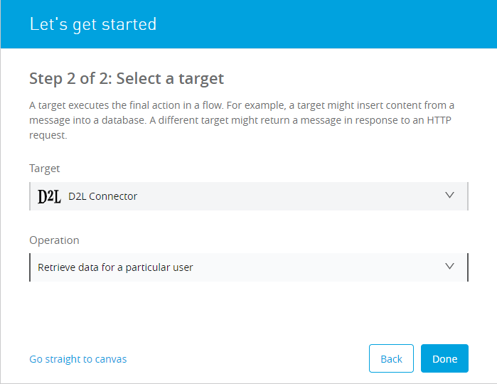
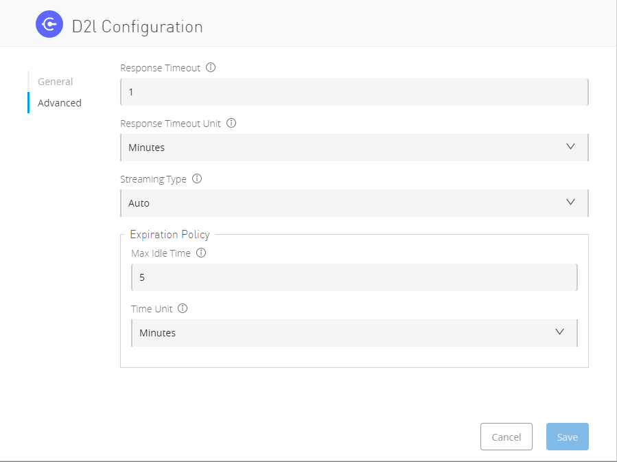

= D2L Connector

== ⦁    DOCUMENT REVISION HISTORY

[%header%autowidth.spread]
|===
|Version  |Release Date |Revised by |Comments/ Indicate Sections Revised
|1.0.0 |2022-10 |Connector Development Team |
|===

== ⦁    INTRODUCTION
⦁   *Purpose*

This specification document outlines the instructions for using D2L Connector operations.

⦁   *Overview*

The D2L (Desire-To-Learn) is a learning platform for personalise learning, increase engagement, and help learners achieve more than they imagined possible. D2L offers flexible and robust learning solutions for every stage of life, from the earliest days of school to higher education and the working world. A connected application in D2L can read, create and update data on the profile of respective user. It can also read/update details of other users if they have proper rights.

== ⦁	LIST OF OPERATIONS SUPPORTED BY THE D2L CONNECTOR:
== Users

[%header%autowidth.spread]
|===
|Sr.No |Business Function |Operations |Inbound |Outbound
|1 |Create a new user entity. |POST Request | Required fields are *FirstName,* *LastName,* *UserName,* *RoleId,* *IsActive,* *SendCreationEmail* |Returns JSON Response
|2 |Reset a particular user’s password. |POST Request |Required fields are NIL |Returns Status Code 200
|3 |Update the personal profile image for the current user context. |POST Request |Upload an image as form-data with key profileImage  |Returns Status Code 200
|4 |Update the profile image for the identified personal profile, by User ID. |POST Request |Upload an image as form-data with key profileImage |Returns Status Code 200
|5 |Update the profile image for the identified personal profile, by Profile ID. |POST Request |Upload an image as form-data with key profileImage |Returns Status Code 200
|6 |Update the current user’s pronoun visilbity preference. |PUT Request |Required fields are *OrgDefinedId,* *FirstName,* *LastName,* *UserName,* *Activation.IsActive* |Returns JSON Response
|7 |Update the current user’s pronoun choices. |PUT Request |Required fields are *ShowPronouns*, *UseUserDefinedPronouns*  |Returns JSON Response
|8 |Update data for a particular user. |PUT Request |Required fields are *OrgDefinedId*, *FirstName*, *LastName,* *UserName,* *Activation.IsActive*  |Returns JSON Response
|9 |Update legal, preferred, and sort name data for a particular user. |PUT Request |Required fields are *LegalFirstName,* *LegalLastName* |Returns JSON Response
|10 |Update a particular user’s activation settings. |PUT Request |Required fields are *IsActive* |Returns JSON Response
|11 |Subscribe to notification messages of a particular type, delivered by a particular carrier. |PUT Request |Required fields are NIL |Returns Status Code 200
|12 |Update a particular user’s password. |PUT Request |Required fields are *Password* |Returns Status Code 200
|13 |Update the personal profile data for the current user context. |PUT Request |Required fields are *Nickname,* *Birthday.Month,* *Birthday.Day,* *HomeTown,* *Email,* *HomePage,* *HomePhone,* *BusinessPhone,* *MobilePhone,* *FaxNumber,* *Address1,* *Address2,* *City,* *Province,* *PostalCode,* *Country,* *Company,* *JobTitle,* *HighSchool,* *University,* *Hobbies,* *FavMusic,* *FavTVShows,* *FavMovies,* *FavBooks,* *FavQuotations,* *FavWebSites,* *FutureGoals,* *FavMemory,* *SocialMediaUrls[].Name,* *SocialMediaUrls[].Url* |Returns JSON Response
|14 |Update a particular personal profile, by Profile ID. |PUT Request |Required fields are *Nickname,* *Birthday.Month,* *Birthday.Day,* *HomeTown,* *Email,* *HomePage,* *HomePhone,* *BusinessPhone,* *MobilePhone,* *FaxNumber,* *Address1,* *Address2,* *City,* *Province,* *PostalCode,* *Country,* *Company,* *JobTitle,* *HighSchool,* *University,* *Hobbies,* *FavMusic,* *FavTVShows,* *FavMovies,* *FavBooks,* *FavQuotations,* *FavWebSites,* *FutureGoals,* *FavMemory,* *SocialMediaUrls[].Name,* *SocialMediaUrls[].Url* |Returns JSON Response
|15 |Unset all attribute values for a user. |DELETE Request |Required fields are NIL |Returns Status Code 200
|16 |Delete a particular user. |DELETE Request |Required fields are NIL |Returns Status Code 200
|17 |Delete the subscription for messages of a particular type, delivered by a particular carrier. |DELETE Request |Required fields are NIL |Returns Status Code 200
|18 |Clear a particular user’s password. |DELETE Request |Required fields are NIL |Returns Status Code 200
|19 |Remove the current user’s profile image. |DELETE Request |Required fields are NIL |Returns Status Code 200
|20 |Remove the profile image from a particular personal profile, by User ID. |DELETE Request |Required fields are NIL |Returns Status Code 200
|21 |Remove the profile image from a particular personal profile, by Profile ID. |DELETE Request |Required fields are NIL |Returns Status Code 200
|22 |Terminate all active sessions for a user. |DELETE Request |Required fields are NIL |Returns Status Code 200
|23 |Retrieve data for one or more users. |GET Request |Required fields are NIL |Returns JSON Response
|24 |Retrieve data for a particular user. |GET Request |Required fields are NIL |Returns JSON Response
|25 |Retrieve the current user's pronoun choices |GET Request |Required fields are NIL |Returns JSON Response
|26 |Retrieve the current user’s pronoun visibility preference. |GET Request |Required fields are NIL |Returns JSON Response
|27 |Retrieve legal, preferred, and sort names for a particular user. |GET Request |Required fields are NIL |Returns JSON Response
|28 |Retrieve the current user context’s user information. |GET Request |Required fields are NIL |Returns JSON Response
|29 |Retrieve a particular user’s activation settings. |GET Request |Required fields are NIL |Returns JSON Response
|30 |Retrieve all the carrier channels for delivering notification messages. |GET Request |Required fields are NIL |Returns JSON Response
|31 |Retrieve all the current subscriptions for notification messages. |GET Request |Required fields are NIL |Returns JSON Response
|32 |Retrieve the current user’s profile image. |GET Request |Required fields are NIL |Returns JSON Response
|33 |Retrieve a particular profile image, by Profile ID. |GET Request |Required fields are NIL |Returns JSON Response
|34 |Retrieve a particular profile image, by User ID. |GET Request |Required fields are NIL |Returns JSON Response
|35 |Retrieve personal profile information for the current user context. |GET Request |Required fields are NIL |Returns JSON Response
|36 |Retrieve a particular personal profile, by Profile ID. |GET Request |Required fields are NIL |Returns JSON Response
|37 |Retrieve a particular personal profile, by User ID. |GET Request |Required fields are NIL |Returns JSON Response
|38 |Retrieve a list of all known user roles. |GET Request |Required fields are NIL |Returns JSON Response
|39 |Retrieve a particular user role. |GET Request |Required fields are NIL |Returns JSON Response
|40 |Retrieve a list of all the enrolled user roles the calling user can view in an org unit. |GET Request |Required fields are NIL |Returns JSON Response
|41 |Retrieve user attributes schema definitions. |GET Request |Required fields are NIL |Returns JSON Response

|===
== Grades

[%header%autowidth.spread]
|===
|Sr.No |Business Function |Operations |Inbound|Outbound
|1 |Retrieve all the current grade objects for a particular org unit.|GET Request|Required feilds are NIL
|Returns JSON Response
|2 |Retrieve a specific grade object for a particular org unit.|GET Request|Required feilds are NIL
|Returns JSON Response
|3 |Retrieve a list of users with access to a specified grade.|GET Request|Required feilds are NIL
|Returns JSON Response
|4 |Retrieve a list of all grade categories for a provided org unit.|GET Request|Required feilds are NIL
|Returns JSON Response
|5 |Retrieve a specific grade category for a provided org unit.|GET Request|Required feilds are NIL
|Returns JSON Response
|6 |Retrieve a particular grade scheme.|GET Request|Required feilds are NIL
|Returns JSON Response
|7 |Retrieve the final grade value for a particular user|GET Request|Required feilds are NIL
|Returns JSON Response
|8 |Retrieve a list of final grade values for the current user context across a number of org units.|GET Request|Required feilds are NIL
|Returns JSON Response
|9 |Retrieve each users final grade value for a particular org unit.|GET Request|Required feilds are NIL
|Returns JSON Response
|10 |Retrieve all the grade objects for the current user context assigned in a particular org unit.|GET Request|Required feilds are NIL
|Returns JSON Response
|11 |Retrieve all the grade objects for a particular user assigned in an org unit.|GET Request|Required feilds are NIL
|Returns JSON Response
|12 |Retrieve all the course completion records for an org unit.|GET Request|Required feilds are NIL
|Returns JSON Response
|13 |Get statistics for a specified grade item.|GET Request|Required feilds are NIL
|Returns JSON Response
|14 |Retrieve all the exempt users for a provided grade.|GET Request|Required feilds are NIL
|Returns JSON Response
|15 |Retrieve all the grade objects for a provided user in a provided org unit with exemption status included.|GET Request|Required feilds are NIL
|Returns JSON Response
|16 |Retrieve all the grade schemes for a provided org unit.|GET Request|Required feilds are NIL
|Returns JSON Response
|17 |Retrieve the grades configuration for the org unit.|GET Request|Required feilds are NIL
|Returns JSON Response
|18 |Retrieve each users final grade value for a particular org unit.|GET Request|Required feilds are NIL
|Returns JSON Response
|19 |Delete a specific grade object for a particular org unit.|DELETE request|Required fields are NIL
|Returns Status Code 200
|20 |Delete a specific grade category for a provided org unit.|DELETE request|Required feilds are NIL
|Returns Status Code 200
|21 |Remove a users exemption from a grade.|DELETE request|Required feilds are NIL
|Returns Status Code 200
|22 |Delete a course completion.|DELETE request|Required feilds are NIL
|Returns Status Code 200
|23 |Create a new grade object for a particular org unit.|POST Request | Required fields are *MaxPoints,* *CanExceedMaxPoints,* *IsBonus,* *ExcludeFromFinalGradeCalculation,* *Name,* *ShortName,* *GradeType,* *IsHidden* |Returns JSON Response
|24 |Create a new grade category for a provided org unit.|POST Request | Required fields are *Name,* *ShortName,* *CanExceedMax,* *ExcludeFromFinalGrade* |Returns JSON Response
|25 |Recalculate final grade value for provided user in org unit|POST Request | Required fields are NIL
|Returns JSON Response
|26 |Recalculate all final grade values for provided org unit.|POST Request | Required fields are NIL
 |Returns JSON Response
|27 |Create a new course completion for an org unit.|POST Request | Required fields are *UserId,* *CompletedDate,* *ExpiryDate* |Returns JSON Response
|28 |Exempt a user from a grade.|POST Request | Required fields are NIL
 |Returns JSON Response
|===
== Course

[%header%autowidth.spread]
|===
|Sr.No |Business Function |Operations |Inbound |Outbound
|1 |Retrieve the list of parent org unit type constraints for course offerings |GET Request | Required fields are NIL |Returns JSON Response
|2 |Retrieve a course offering |GET Request |Required fields are NIL |Returns JSON Response
|3 |Retrieve the list of parent org unit type constraints for course offerings built on this template |GET Request |Required fields are NIL |Returns JSON Response
|4 |Retrieve a course template. |GET Request |Required fields are NIL |Returns JSON Response
|5 |Create a new course offering |POST Request |Required fields are  *Name,* *Code,* *Path,* *CourseTemplateId,* *ForceLocale,* *ShowAddressBook,* *Description,* *CanSelfRegister* |Returns JSON Response
|6 |Create a new course template |POST Request |Required fields are *Name,* *Code,* *Path,* *ParentOrgUnitIds[].D2LID* |Returns JSON Response
|7 |Delete a course offering |DELETE Request |Required fields are NIL  |Returns Status Code 200
|8 |Delete a course template |DELETE Request |Required fields are NIL |Returns Status Code 200
|===
== Calendar
[%header%autowidth.spread]
|===
|Sr.No |Business Function |Operations |Inbound |Outbound
|1 |Retrieve a calendar event from a particular org unit. |GET Request |Required fields are NIL |Returns JSON Response
|2 |Retrieve all the calendar events for the calling user, within the provided org unit context. |GET Request |Required fields are  NIL |Returns JSON Response
|3 |Retrieve the calling user’s calendar events, within a number of org units (see query parameter) |GET Request |Required fields are *orgUnitIdsCSV,* *startDateTime,* *endDateTime* |Returns JSON Response
|4 |Retrieve the calling user’s events for a particular org unit |GET Request |Required fields are  *startDateTime,* *endDateTime*  |Returns JSON Response
|5 |Retrieve a count of calling user's calendar events, within a number of org units  |GET Request |Required fields are *orgUnitIdsCSV,* *startDateTime,* *endDateTime* |Returns JSON Response
|6 |Retrieve all the calendar events for the calling user, within a number of org units. |GET Request |Required fields are  *orgUnitIdsCSV,* *startDateTime,* *endDateTime*  |Returns JSON Response
|7 |Retrieve all the calendar events for a specified user’s explicit enrollments within the organization containing the specified org unit |GET Request |Required fields are  *userId,* *startDateTime,* *endDateTime*  |Returns JSON Response
|8 |Retrieve a count of calling user’s calendar events, within the provided org unit context |GET Request |Required fields are  *startDateTime,* *endDateTime* |Returns JSON Response
|9 |Create a new event. |POST Request |Required fields are  *Title,* *RecurrenceInfo,* *LocationName,* *AssociatedEntity,* *AssociatedEntity*  |Returns JSON Response
|10 |Update the properties for a calendar event from a particular org unit. |PUT Request |Required fields are  *Title,* *RecurrenceInfo,* *LocationName,* *AssociatedEntity,* *AssociatedEntity* |Returns JSON Response
|11 |Remove a calendar event from a particular org unit. |DELETE Request |Required fields are  NIL | Returns Status Code 200
|===
== Checklist
[%header%autowidth.spread]
|===
|Sr.No |Business Function |Operations |Inbound |Outbound
|1 |Retrieve all checklists belonging to an org unit. |GET Request |Required fields are  NIL |Returns JSON Response
|2 |Retrieve all categories belonging to a checklist. |GET Request |Required fields are  NIL |Returns JSON Response
|3 |Retrieve all items belonging to a checklist. |GET Request |Required fields are  NIL |Returns JSON Response
|4 |Retrieve a checklist belonging to an org unit. |GET Request |Required fields are  NIL |Returns JSON Response
|5 |Retrieve a category belonging to a checklist |GET Request |Required fields are  NIL |Returns JSON Response
|6 |Retrieve an item belonging to a checklist |GET Request |Required fields are  NIL |Returns JSON Response
|7 |Create a checklist in the specified org unit. |POST Request |Required fields are *Name,* *Description* |Returns JSON Response
|8 |Create a checklist category in the specified checklist. |POST Request |Required fields are  *Name,* *Description,* *SortOrder* |Returns JSON Response
|9 |Create a checklist item in the specified checklist. |POST Request |Required fields are *Name,* *Description,* *SortOrder* |Returns JSON Response
|10 |Update an existing checklist in the specified org unit. |PUT Request |Required fields are  *Name,* *Description* |Returns JSON Response
|11 |Update an existing checklist category in an existing checklist. |PUT Request |Required fields are *Name,* *Description,* *SortOrder* |Returns JSON Response
|12 |Update an existing checklist item in an existing checklist. |PUT Request |Required fields are  *CategoryId,* *Name,* *Description,* *SortOrder* |Returns JSON Response
|13 |Delete an existing checklist in the specified org unit. |DELETE Request |Required fields are NIL |Returns Status Code 200
|14 |Delete an existing checklist category in an existing checklist. |DELETE Request |Required fields are  NIL |Returns Status Code 200
|15 |Delete an existing checklist item in an existing checklist. |DELETE Request |Required fields are NIL |Returns Status Code 200
|===

==  ⦁   CONFIGURATION FOR D2L CONNECTOR
To use D2L Connector, you will require the following configuration properties.

    Base URL: Base URL of D2l Brightspace platform.

    Refresh Token URL: URL for Refresh Token generation.

    Client ID: Client ID of application registered in Brightspace Platform.

    Client Secret: Client Secret of application registered in Brightspace Platform.

    Refresh Token: Valid and Active refresh token generated explicitly by user

    Access Token: Valid and Active access token generated explicitly by user

    Connection timeout: Timeout for connection, in Seconds(Default).

==  ⦁   TO CONNECT IN DESIGN CENTER

⦁ In Design Centre, click Create and choose Mule Application.

⦁ Click a trigger such as an HTTP Listener or the Scheduler trigger.

image::img/HTTP_listener_design_center.png[]

⦁ To create an HTTP global element for the connector, set these fields:

image::img/HTTP_listener_global_config_design_center.png[]

[%header%autowidth.spread]
|===
|Field |Description
|Protocol |Protocol selected for the HTTP connector, it can be HTTP or HTTPS (secure).
|Host |IP address where your Mule application listens for requests.
|Port |Port address where your Mule application listens for requests.
|Base Path |Path where your Mule application listens for requests.
|===

⦁	Select the plus sign to add a component.

⦁	Select the D2L Connector as a component.

⦁	Select an operation:

⦁	Configure the Global element for the connector:

⦁	Fill the required parameters (if any) for the above selected operation.

==  ⦁   Running in Anypoint Studio :

⦁ Drag and drop an HTTP Listener in the canvas.

⦁ In the Listener properties, give a path you want to use to trigger the listener.

⦁ Add a new Configuration as follows,

image::img/HTTP_Listener_Config.png[]

⦁ Test the connection and click on Okay.

⦁ Make sure your mule palette has D2L module. If you do not have D2L module in your palette, go to search in exchange -> search for D2L and click on Add.

⦁ Now add configurations for D2L.

⦁ Go to global-configurations.xml global elements -> create -> Connector Configuration -> D2L Config

⦁ Add following properties.

    Base URL : (Default)
    Refresh Token URL: (Default)
    Client ID :
    Client Secret :
    Refresh Token :
    Access Token :

image::img/global_config.png[]

image::img/global_config_advanced.png[]

⦁	Use the connector with requireed operation

⦁   *To Install D2L Connector in Anypoint Studio*

link:user-manual.adoc[]

⦁	*About Connector Namespace and Schema*

When designing your application in Studio, drag and drop the connector in your canvas and the Namespace and schema get populated in the config file as below,

*Namespace:*   http://www.mulesoft.org/schema/mule/dtol

*Schema Location:*  http://www.mulesoft.org/schema/mule/dtol/current/mule-dtol.xsd
