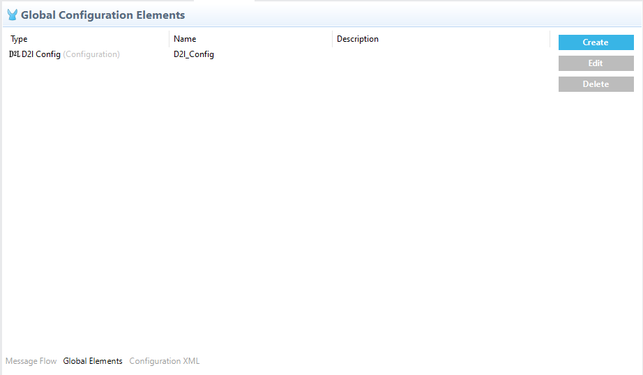
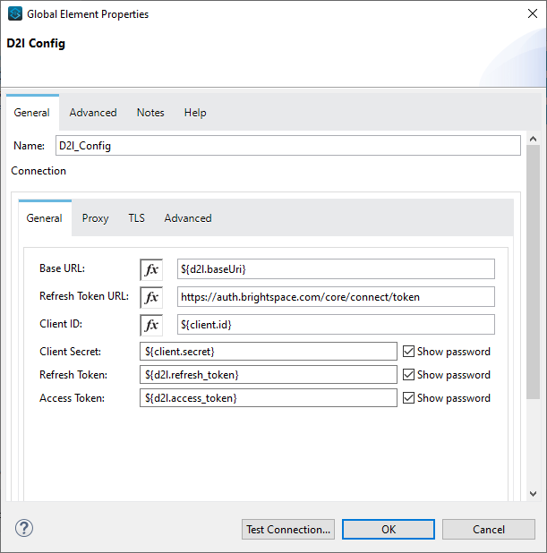
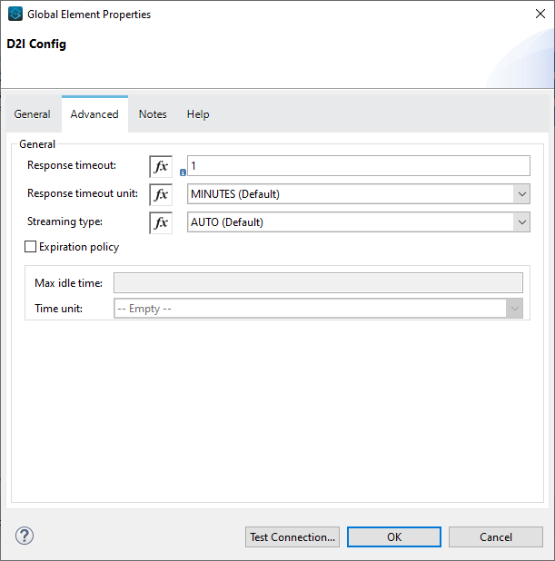
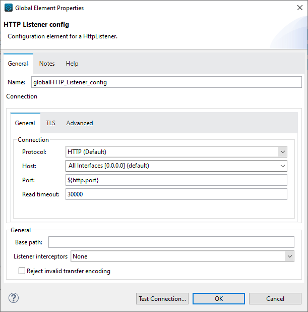
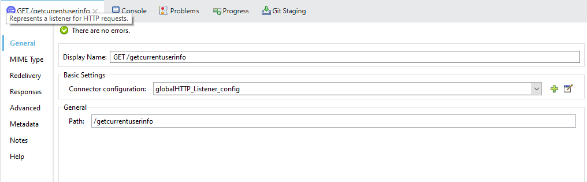
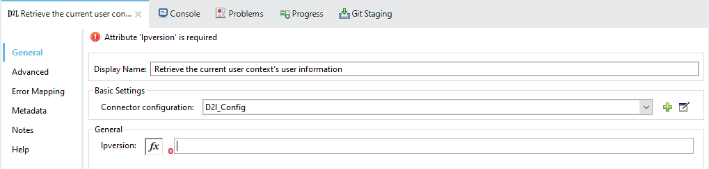
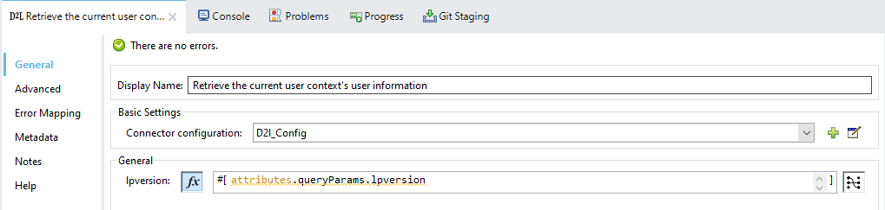
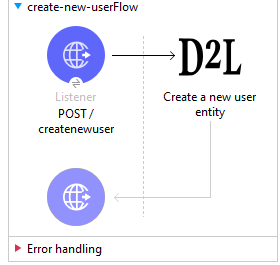

= D2L Connector

MuleSoft Certified

== About D2L

The D2L (Desire-To-Learn) is a learning platform for personalise learning, increase engagement, and help learners achieve more than they imagined possible. D2L offers flexible and robust learning solutions for every stage of life, from the earliest days of school to higher education and the working world. A connected application in D2L can read, create and update data on the profile of respective user. It can also read/update details of other users if they have proper rights.

== About D2L Connector

Anypoint Connector for D2L provides the capability to perform multiple operations related to D2L Brightspace learning platform in understandable JSON format.

== Prerequisites
This document assumes that you are familiar with Mule, Anypoint Connectors,
Anypoint Studio Essentials, Mule flows, and Mule Global Elements.

To use D2L connector, you need

* Anypoint Studio version 7.

== Mule Compatibility

[width="100%", options="header"]
|=======
|Application/Service |Version
|Mule Runtime |4.1.x and later
|Anypoint Studio | 7.4.x and later
|=======

== What's New in this Connector

* This D2L connector 1.0.0 is compatible with Mule 4.

== To Install this Connector in Anypoint Studio 7
You can use D2L Connector in Anypoint Studio by adding it as a dependency in your Mule application.

. Open your Mule project in Anypoint Studio.
. Add the connector as a dependency in the pom.xml file:

```
<dependency>
    <groupId>com.mulesoft.connectors</groupId>
    <artifactId>D2L</artifactId>
    <version>1.0.0</version>
    <classifier>mule-plugin</classifier>
</dependency>
```

When Studio has an update, a message displays in the lower right corner, which
you can click to install the update. After updating, update Maven pom.xml file dependencies to the new version.

== Configure in Studio

=== To Configure the Connector
* After adding connector dependency to Mule project, click on *Global Elements* tab at the base of the canvas.
* In the Global Mule Configuration Elements screen, click *Create*.
* In the Choose Global Type wizard, collapse connector configuration and select *'D2L Config'* and click OK.



* The configuration parameters to configure is

+
[options="header",width="50%"]
|============
|Field Name         |Value
|Base URL           |Base URL of D2l Brightspace platform.
|Refresh Token URL   |URL for Refresh Token generation.
|Client ID            |Client ID of application registered in Brightspace Platform.
|Client Secret            |Client Secret of application registered in Brightspace Platform.
|Refresh Token            |Valid and Active refresh token generated explicitly by user
|Access Token            |Valid and Active access token generated explicitly by user
|Response Timeout   |Timeout for response, in Minutes(Default).

|============
+

* Parameter values can be directly entered into the global configuration properties, or reference from a configuration file that contains these values.
Here we are adding values to application properties file and reference it using placeholders.





* Make a *Test Connection...* to check that the configuration is correct.

* On success, configuration is ready to use!

* D2L_Config configuration should look like below in Configuration XML:
+
```xml
   <dtol:config name="D2l_Config" doc:name="D2l Config" doc:id="73c878ee-49cb-4dcc-890c-406a0e3737d2" >		
		<dtol:oauth-connection client_id="${client.id}" client_secret="${client.secret}" baseUrl="${d2l.baseUri}" refresh_token="${d2l.refresh_token}" access_token="${d2l.access_token}"/>
	</dtol:config>
```


== ​To Create a Mule Project in Anypoint Studio 7

The D2L connector is an operation-based connector, which means that when you add the connector to your flow, you need to configure a specific operation the connector is intended to perform. Below is the *"Retrieve the current user context's user information"* operation for better understanding.

* Create new Mule Application in Studio and configure *HTTP Listener* to port 8081.



* Add "/getcurrentuserinfo" path to test the flow.



* Select *'Retrieve the current user context's user information'* operation from D2L module, drag & drop it into canvas. Click on the operation.



* Select D2L configuration from drop down which was already configured previously in global elements, or if required new configuration can be added by clicking green plus (+) symbol.


* Make sure to test your connection, if you have add new connection details.
* Enter required details for *Retrieve the current user context's user information* operation and save.



* Save the Mule project.
* Complete flow looks as below.



* Run the project as a Mule Application by right-clicking the project name in the Package Explorer, selecting Run As > Mule Application.
* Open Postman and check the response after entering the URL *http://localhost:8081/getcurrentuserinfo*. You should see the 200 OK.This mean request has been sent successfully

```xml
<?xml version="1.0" encoding="UTF-8"?>

<mule xmlns:http="http://www.mulesoft.org/schema/mule/http"
	xmlns:dtol="http://www.mulesoft.org/schema/mule/dtol"
	xmlns="http://www.mulesoft.org/schema/mule/core"
	xmlns:doc="http://www.mulesoft.org/schema/mule/documentation"
	xmlns:xsi="http://www.w3.org/2001/XMLSchema-instance"
	xsi:schemaLocation="http://www.mulesoft.org/schema/mule/core http://www.mulesoft.org/schema/mule/core/current/mule.xsd
http://www.mulesoft.org/schema/mule/dtol http://www.mulesoft.org/schema/mule/dtol/current/mule-dtol.xsd
http://www.mulesoft.org/schema/mule/http http://www.mulesoft.org/schema/mule/http/current/mule-http.xsd">
	<flow name="get-current-user-infoFlow"
		doc:id="b27cc605-bc58-4018-861e-60d15b3949a2">
		<http:listener doc:name="GET /getcurrentuserinfo"
			doc:id="b37ca913-af0f-4d19-aedb-1214c97d5b3f"
			config-ref="globalHTTP_Listener_config" path="/getcurrentuserinfo" />
		<dtol:retrieve-current-users-information
			doc:name="Retrieve the current user context's user information"
			doc:id="fbccf0e4-be58-4e23-a60e-552845cdf505" config-ref="D2l_Config"
			lpversion="#[attributes.queryParams.lpversion]" />
	</flow>
</mule>

```

== See Also

link:release-notes.adoc[]


